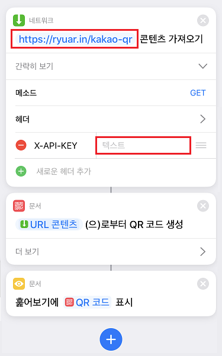
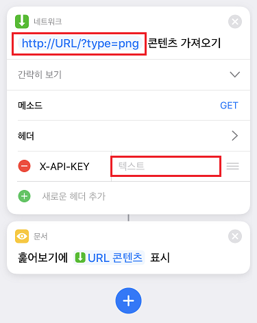

**앞서 이 프로그램은 [김동성](https://github.com/kiding) 님이 제작하신 [kakao-qr-api](https://github.com/kiding/kakao-qr-api) 리포지토리를 바탕으로 만들었음을 알려드립니다.**

AWS 서버를 사용하지 않고 활용하고자 만들었습니다.

# kakao-qr-api-go

- 원격으로 카카오 계정에 로그인한 후 QR 체크인 데이터를 반환하는 API를 구성합니다.

- 본 프로그램에서 카카오톡 인증을 처리하므로 스마트폰 잠금 해제 후 카카오톡 앱을 여는 과정 없이 QR을 생성할 수 있습니다.

- iOS 단축어(Shortcuts) 앱 등 자동화에 활용할 수 있습니다.

- 카카오 계정에 대한 로그인이 유지되는 한 다시 로그인하지 않습니다.

- 생성된 QR 코드는 14초간 보관합니다.

[](https://github.com/kiding/kakao-qr-api)

## 설치하기

- 카카오톡 앱 상의 QR 체크인 서비스를 사용하여 최초 인증 및 동의 과정을 한번 이상 거친 경우에만 사용할 수 있습니다.

- 2단계 인증이 설정된 [카카오 계정](https://accounts.kakao.com/)은 사용이 불가능합니다.

- 설정한 URL 로 `X-API-KEY` 헤더와 함께 HTTP GET 요청하여 활용할 수 있습니다. 자세한 내용은 하단 [사용 방법](#사용_방법)을 참고해주세요.

- 약 `400 MiB` 의 메모리 여유가 필요합니다.

1. [Golang](https://golang.org/) 설치

    - 개발 환경 : `go 1.15.2`

1. Chromium 설치

    - ArchLinux

        ```shell
        sudo pacman -Sy chromium
        ```

1. 리포지토리 다운로드 및 빌드

    ```shell
    git clone https://github.com/RyuaNerin/kakao-qr-api-go.git
    cd kakao-qr-api-go
    go build
    ```

1. `config.json` 파일을 생성 후 아래의 형태로 값을 채워주세요

    - `kakao-id`, `kakao-pw` : 카카오톡 계정의 아이디와 비밀번호
    - `api-key` : 다른 사람이 사용하지 못하게 하는 용도로 사용할 값
        - 유용한 명령어 : `head /dev/urandom | tr -dc A-Za-z0-9 | head -c 40; echo`

    - `bind` : 네트워크 바인딩

        - `*:56062`
        - `127.0.0.1:56062`
        - `/var/run/kakaoqr/kakaoqr.sock`
        - etc ...

    ```json
    {
        "kakao-id": "카카오톡아이디",
        "kakao-pw": "카카오톡비밀번호",

        "api-key": "인증키",

        "bind": "127.0.0.1:56062"
    }
    ```

1. kakaoqr 실행

    ```shell
    ./kakaoqr
    ```

### nginx (선택)

```nginx
server {
    (...)

    location /kakao-qr {
        proxy_pass       http://127.0.0.1:56062;
        proxy_set_header X-Real-IP $remote_addr;
    }

    (...)
}
```

### systemd (선택)

1. 유저 추가

    ```shell
    sudo useradd \
        kakaoqr \
        --comment 'kakao check-in qr api' \
        --shell '/usr/bin/nologin' \
        --home-dir '/usr/local/kakaoqr/' \
        --gid 'nobody' \
        --no-user-group
    ```

1. `kakaoqr`, `config.json` 파일 복사 및 권한 설정

    ```shell
    go build
    sudo mkdir -p '/usr/local/kakaoqr/'
    sudo cp 'kakaoqr' 'config.json' '/usr/local/kakaoqr/'
    sudo chown kakaoqr:nobody -R '/usr/local/kakaoqr/'
    sudo chmod 400 '/usr/local/kakaoqr/config.json'
    ```

1. `kakaoqr.service` 파일 복사 및 활성화

    ```shell
    sudo cp 'kakaoqr.service' '/etc/systemd/system'
    sudo systemctl enable 'kakaoqr.service'
    sudo systemctl start 'kakaoqr.service'
    ```

### fail2ban (선택)

1. 관련 파일 복사

    ```shell
    sudo cp 'fail2ban.conf'      '/etc/fail2ban/filter.d/kakaoqr.local'
    sudo cp 'fail2ban-jail.conf' '/etc/fail2ban/jail.d/kakaoqr.local'
    ```

1. 차단 정책 변경

    ```shell
    sudo vi '/etc/fail2ban/jail.d/kakaoqr.local'
    ```

1. fail2ban 재시작

    ```shell
    sudo systemctl restart fail2ban.service
    ```

## 사용 방법

- plain text 로 얻어오는 방법

    ```shell
    curl -H 'X-API-KEY: <설정한 값>' 'http://127.0.0.1:56062/'
    curl -H 'X-API-KEY: <설정한 값>' 'http://127.0.0.1:56062/?type=txt'
    ```

- qrcode 이미지로 얻어오는 방법

    ```shell
    curl -H 'X-API-KEY: <설정한 값>' 'http://127.0.0.1:56062/?type=png'
    curl -H 'X-API-KEY: <설정한 값>' 'http://127.0.0.1:56062/?type=png&size=512'
    ```

- 자동화 예시: iOS 단축어(Shortcuts)
    - txt 예제 : [https://www.icloud.com/shortcuts/8f1a474fefd542fe8f0b139f2ff7ae8a](https://www.icloud.com/shortcuts/8f1a474fefd542fe8f0b139f2ff7ae8a)
    - png 예제 : [https://www.icloud.com/shortcuts/2f51336b1fe54d19b7eba07a445952ea](https://www.icloud.com/shortcuts/2f51336b1fe54d19b7eba07a445952ea)

    

    

## LICENSE

- 이 리포지토리는 [GNU General Public License v3.0](LICENSE) 하에 배포됩니다.
